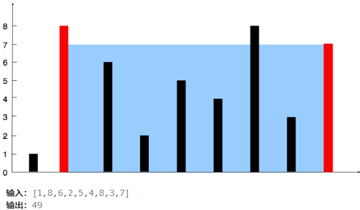
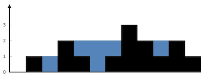

2.给定一个长度为 n 的整数数组 height 。有 n 条垂线，第 i 条线的两个端点是 (i, 0) 和 (i, height[i]) 。 找出其中的两条线，使得它们与 x 轴共同构成的容器可以容纳最多的水。 返回容器可以储存的最大水量。




- 思路：

​	初始时，一个指针指向数组的起始位置，另一个指针指向数组的末尾。每次迭代中，计算当前两指针所能容纳的水量，并更新最大水量。然后移动两个指针中较短的那个向内侧靠近，因为移动较长的那一个不会增加潜在的最大高度，而移动较短的那一个可能会找到更高的边，从而有可能增加容量。重复这个过程直到两个指针相遇。

- 实现：

  - 初始化两个指针，分别位于数组的两端。

  - 初始化一个变量用于记录目前为止最大的水量。

  - 在指针不相交的情况下，循环执行以下操作：

    - 计算当前由两个指针所确定的容器的水量，并更新最大水量。
    - 移动较短的那一端的指针向内移动一位。

  - 返回记录的最大水量。

    ```java
        public int maxArea(int[] height) {
     int ans = 0;
            int left = 0;
            int right = height.length - 1;
            while (left < right) {
                int area = (right - left) * Math.min(height[left], height[right]);
                ans = Math.max(ans, area);
                if (height[left] < height[right]) {
                    // height[left] 与右边的任意线段都无法组成一个比 ans 更大的面积
                    left++;
                } else {
                    // height[right] 与左边的任意线段都无法组成一个比 ans 更大的面积
                    right--;
                }
            }
            return ans;
        }
    ```

  - Math.min(a,b)：取a、b中最小值


3.给你一个整数数组 `nums` ，判断是否存在三元组 `[nums[i], nums[j], nums[k]]` 满足 `i != j`、`i != k` 且 `j != k` ，同时还满足 `nums[i] + nums[j] + nums[k] == 0` 。请你返回所有和为 `0` 且不重复的三元组。

- 思路：

排序 + 双指针

- 实现：

- 排序：
  - 首先对数组进行排序。这样做有助于`避免重复组合`，并简化后续使用双指针时的操作。

- 遍历数组：
  - 使用一个循环遍历排序后的数组，对于每一个元素（假设当前元素为`nums[i]`），尝试寻找两个其他的数，使得这三个数之和为0。

- 双指针查找：
  - 对于每个选定的`nums[i]`，设定两个指针，一个从`i+1`开始（左指针`left`），另一个从数组的末尾开始（右指针`right`）。
  - 根据 nums[i] + nums[left] + nums[right]的结果调整这两个指针的位置：
    - 如果三者的和等于0，那么这是一个有效的三元组，记录下来。
    - 如果三者的和小于0，说明需要更大的数来接近0，因此将左指针向右移动一位。
    - 如果三者的和大于0，说明需要更小的数来接近0，因此将右指针向左移动一位。
    - 在这个过程中，如果遇到相同的元素，为了确保结果中没有重复的三元组，应该跳过这些重复项。

- 避免重复解：

  - 由于数组已经排序，在遍历时如果发现当前元素与前一个元素相同，则可以直接跳过当前元素以避免产生重复的三元组。

  - 同样地，在找到一个有效三元组后，左右指针也应该跳过任何连续相同的元素以避免重复添加相同的三元组。

    ```java
    public List<List<Integer>> threeSum(int[] nums) {
        Arrays.sort(nums);
        List<List<Integer>> result = new ArrayList<>();
        for(int i = 0; i < nums.length - 2; i++){
            if (i > 0 && nums[i] == nums[i-1]) continue;
            int left = i+1;
            int right = nums.length - 1;
            while(left < right){
                int temp = nums[i] + nums[left] + nums[right];
                if( temp == 0){
                    result.add(Arrays.asList(nums[i],nums[left],nums[right]));
                    while (left < right && nums[left] == nums[left+1]) left++;//避开所有相同的元素
                    while (left < right && nums[right] == nums[right-1]) right--;
                    left++;
                    right--;
                }
                else if(temp < 0) {
                    left ++;
                }
                else if(temp > 0){
                    right --;
                }
            }
        }
        return result;
    }
    ```

    - List<List<Integer>> ：集合中存放集合        经典句式： List<List<Integer>> result = new ArrayList<>();
    - result.add()：向集合result中添加集合
    - Arrays.asList(nums[i],nums[left],nums[right])：将nums[i],nums[left],nums[right]作为集合
    - Arrays.sort(nums) ：数组排序(降序)


5. 给定 `n` 个非负整数表示每个宽度为 `1` 的柱子的高度图，计算按此排列的柱子，下雨之后能接多少雨水。

   

- 思路：

  分别从左右两边看，一边高的情况下，另一边的坑总能接到水，比如nums[right] = 正无穷 。左边的坑无论怎样变化，是高是低，

  都有右边替他顶着，所以能储水，所以放双指针在两边，哪边高就算另一边的坑直到出现更高的。

- 实现：

- 初始化：首先设立两个指针，一个在最左边（left），一个在最右边（right）。同时，我们也需要记录左边的最大高度（maxLeft）和右边的最大高度（maxRight），初始值都设为0。

- 迭代：

  - 当 `left <= right` 时，循环执行以下步骤。
  - 如果当前左边的高度小于等于右边的高度：
    - 如果当前左柱子的高度大于或等于 `maxLeft`，更新 `maxLeft`。
    - 否则，意味着可以在当前位置存储水，因为左边有更高的柱子。计算可以存储的水量为 `maxLeft - height[left]` 并累加到总水量中。
    - 移动左指针向右。
  - 当 `left >= right` 时，循环执行类似步骤。

  ```java
      public int trap(int[] height) {
          int left = 0，right =height.length - 1;
          int storeWater = 0;
          int heightmaxleft = 0,heightmaxright = 0;
          while(left < right){
              if(height[left] <= height[right]){
                  if(height[left] >= heightmaxleft){
                      heightmaxleft = height[left];
                  }
                  else{
                      storeWater += heightmaxleft - height[left];
                  }
                  left ++;
              }
              else{
                  if(height[right] >= heightmaxright){
                      heightmaxright = height[right];
                  }
                  else{
                      storeWater += heightmaxright - height[right];
                  }
                  right --;
              }
          }
          return storeWater;
      }
  ```

  