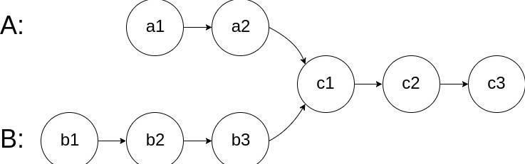
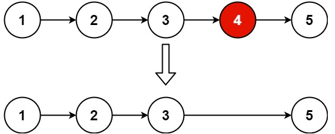

#### 160.给你两个单链表的头节点 `headA` 和 `headB` ，请你找出并返回两个单链表相交的起始节点。如果两个链表不存在相交节点，返回 `null` 。图示两个链表在节点 `c1` 开始相交**：**



- **思路**

​	让指针 `pointerA` 遍历到链表A的末尾时，重定位它到链表B的头部继续遍历。指针`pointerB`同样，这是为平衡两个链表长度的差异，使得两个指针能够在相同的时间内遍历完两个链表，并在相交节点处相遇。

- - **分类讨论**
    - A、B平行，A遍历完走B，最终第二轮遍历时二者同时到达null，返回null
    - A、B相交
      - A、B非重合段一样长，第一轮相遇
      - A、B非重合段不等长，终有一轮相遇(不可能平行)

- **实现**

  - 初始化两指针 `pointerA` 和 `pointerB` 分别指向链表 `headA` 和 `headB` 的头部。
  - 遍历两个链表：
    - 如果 `pointerA` 到达链表末尾，则将其重定位到 `headB` 的头部；同样地，如果 `pointerB` 到达链表末尾，则将其重定位到 `headA` 的头部。
    - 否则，将 `pointerA` 和 `pointerB` 分别移动到各自的下一个节点。
  - 当 `pointerA` 和 `pointerB` 相等时，即找到了相交的起始节点，或者两者都到达了链表的末尾。

- **链表相关**

  声明一个公共类 `ListNode`。类中包含val和next两个元素，val存储数据，next指向像一个元素(初始 = null)

  ```java
  public class ListNode {
      int val;
      ListNode next;
      ListNode(int x) {
          val = x;
          next = null;
      }
  }
  public ListNode getIntersectionNode(ListNode headA, ListNode headB) {
      if (headA == null || headB == null) return null;
      ListNode pointerA = headA, pointerB = headB;
      while (pointerA != pointerB) {
          pointerA = pointerA == null ? headB : pointerA.next;
          pointerB = pointerB == null ? headA : pointerB.next;
      }
      return pointerA; // 在这里，pointerA 和 pointerB 指向同一个节点，即相交的起始节点，或者都是 null。
  }
  ```


#### 206.给你单链表的头节点 `head` ，请你`反转链表`，并返回反转后的链表。

- **思路**

  定义两个`ListNode`类型的指针，`prev`装上一个元素(初始null)，`current`装当前元素，临时变量`temp`存下一个元素(类似数组两元素交换)，`current`的next指向`prev`后，两元素往后进一个。

- **实现**

  - **初始化三个指针**

    - `prev`（前一个节点），初始为 `null`。
    - `current`（当前节点），初始为链表头节点 `head`。
    - `next`（临时-下一个节点），用于暂存当前节点的下一个节点。

  - **遍历链表**

    - 对于每个节点，先保存当前节点的下一个节点到 `next`。
    - 将当前节点的 `next` 指针指向 `prev`，实现反转。
    - 更新 `prev` 为当前节点，`current` 为之前保存的 `next` 节点，继续下一个节点的操作。

  - **循环结束条件**

    - 当 `current` 变为 `null` 时，表示已经到达原链表的末尾，此时 `prev` 指向新链表的头节点。

  - **返回新链表的头节点**

    - 返回 `prev` 作为反转后链表的新头节点。

    ```java
        public ListNode reverseList(ListNode head) {
            ListNode prev = null, current = head;
            while(current != null){
                ListNode tempNext = current.next;
                current.next = prev;
                prev = current;
                current = tempNext;
            }
            return prev;
        }
    ```

    

#### 234.给你一个单链表的头节点 `head` ，请你判断该链表是否为回文链表。如果是，返回 `true` ；否则，返回 `false` 。

这题没仔细看，记得补

- **思路**
  - 一开始想的是反转链表，再与原链表比较，但是方法中**直接操作了原始链表的节点及其 `next` 指针，所以在反转过程中，每个节点的 `next` 指针都被重新指向了前一个节点 (`prev`)，这导致原始链表的顺序被破坏。**所以还需要拷贝一份。
  - 方法二：仅反转链表的一半
    - **找到链表中间点**：使用快慢指针技巧，`fast` 指针每次移动两步，`slow` 每次移动一步，这样当 `fast` 到达链表末尾时，`slow` 就位于链表的中间位置。
    - **反转链表的后半部分**：从 `slow` 开始反转链表的后半部分。
    - **比较前半部分和反转后的后半部分**：从前端开始遍历到中间，并同时从反转后的后半部分链表开始遍历，比较对应节点的值是否相等。

- **标准**

  - 寻找中间节点

    - 快慢指针法用于找到链表的中点。`fast` 指针每次前进两个节点，而 `slow` 指针每次前进一个节点。当 `fast` 达到链表末尾时，`slow` 将指向链表的中间节点。

  - 反转链表的后半部分

    - 从 `slow` 开始反转链表的后半部分。这样做是为了能够从前向后和从后向前同时遍历链表，从而比较节点值是否对称。

  - 比较前半部分和反转后的后半部分

    - 使用两个指针分别从链表头部和反转后的链表头部开始遍历，逐个比较它们的 `val` 字段。如果所有对应节点的值都相同，则链表是回文；否则不是。

  - 处理奇数长度链表

    - 如果链表长度为奇数，`fast` 不会为 `null`，此时 `slow` 应该跳过中间节点（因为中间节点不影响回文判断），可以通过在找到中间节点之后添加 `if (fast != null) { slow = slow.next; }` 来实现。

    ```java
        public boolean isPalindrome(ListNode head) {
           if (head == null || head.next == null) return true;
            // 使用快慢指针找到中间节点
            ListNode slow = head, fast = head;
            while (fast != null && fast.next != null) {
                slow = slow.next;
                fast = fast.next.next;
            }
            // 反转后半部分链表
            ListNode prev = null;
            ListNode current = slow;
            while (current != null) {
                ListNode nextTemp = current.next;
                current.next = prev;
                prev = current;
                current = nextTemp;
            }
            // 比较前半部分和反转后的后半部分
            ListNode left = head;
            ListNode right = prev; // 反转后的头节点
            while (right != null) { // right会先到达链表末端
                if (left.val != right.val) return false;
                left = left.next;
                right = right.next;
            }
            return true;
    }
    ```


#### 141.给你一个链表的头节点 `head` ，判断链表中是否有环。如果链表中有某个节点，可以通过连续跟踪 `next` 指针再次到达，则链表中存在环。 为了表示给定链表中的环，评测系统内部使用整数 `pos` 来表示链表尾连接到链表中的位置（索引从 0 开始）。如果链表中存在环 ，则返回 `true` 。 否则，返回 `false` 。

```说明
输入：head = [3,2,0,-4], pos = 1
输出：true
解释：链表中有一个环，其尾部连接到第二个节点。
```

- 思路
  - 如果链表中存在环，`fast` 和 `slow` 都会在环内不断循环。设`fast` 的速度是 `slow` 的两倍，它们之间的距离每次都会减少 1，因此最终一定会相遇。
  
  - 如果链表没有环，`fast` 会更快到达链表尾部（`null`），从而终止循环。
  
    ```java
    A -> B -> C -> D -> E -> F   //原本
    ```
  
    ```java
    A -> B -> C <- D <- E <- F    //反转后
    ```
  
    
  
- 实现

  - 初始化两个指针：
    - `slow` 和 `fast` 都指向链表的头节点 `head`。
  - 遍历链表：
    - 移动 `slow` 一次（`slow = slow.next`）。
    - 移动 `fast` 两次（`fast = fast.next.next`）。
    - 如果在某次移动后，`slow == fast`，则说明链表中有环，返回 `true`。
  - 如果 `fast` 或 `fast.next` 变为 `null`，说明链表无环，返回 `false`。

  ```java
      public boolean hasCycle(ListNode head) {
          if(head == null|| head.next == null)
          return false;
          ListNode fast = head;
          ListNode slow = head;
          while(fast != null && fast.next != null){
              slow = slow.next;
              fast = fast.next.next;
              if(slow == fast){
                  return true;
              }
          }
          return false;
      }
  ```

  - 快慢指针对**链表以及周期**问题非常有效
    - 检测**链表中的环**
      实现：如前所述，当快指针和慢指针相遇时，说明链表中存在环。
    2. 寻找**环的起点**
    实现：首先使用快慢指针找到它们相遇的点。将其中一个指针重新指向链表头，并保持两个指针都以相同的速度（每次一步）前进，直到它们再次相遇。此时相遇的节点即为环的起始节点。
    3. 查找链表的**中间节点**
    实现：快指针每次移动两步，慢指针每次移动一步。当快指针到达链表末尾时，慢指针正好位于链表的中间位置。注意：对于偶数长度的链表，可能会有不同的定义来确定“中间”节点是哪一个。
    4. 判断链表是否为**回文**
    实现：使用快慢指针找到链表的中间节点。反转链表的后半部分。比较前半部分和反转后的后半部分是否相等。
    5. 删除链表的**倒数第 N 个节点**
    实现：快指针先走 N 步。然后快慢指针同时向前移动，直到快指针到达链表末尾。慢指针此时指向的就是要删除的节点。
    6. **周期性**检测
    实现：类似于链表环检测，使用快慢指针遍历数据结构，如果两者相遇，则表明存在循环或重复。

#### 142.环形链表2，在1的基础上返回环形链表入口节点，非链表返回null

- **思路**

  数学问题：

  ```
  d_fast = 2 * d_slow
  ```

  ```
  d_fast - d_slow = n * C  （n 是正整数）  //如果相遇
  ```

  ```
   d_slow = n * C
  ```

  ```
  d_slow = L + x
  ```

  - 非环部分的长度为 `L`。
  - 环的长度为 `C`。
  - 快慢指针第一次相遇时，慢指针在环内距离环入口的距离为 `x`。

  所以快慢相遇于x后，fast再走L格回到环入口，slow从头也是走L来到环入口，二者相遇

- **实现**

  - 将其中一个指针 `slow`重新指向链表头节点 `head`。
  - 然后让两个指针以相同的速度（每次一步）前进，直到它们再次相遇。此时相遇的节点就是环的入口节点。

  ```java
      public ListNode detectCycle(ListNode head) {
          if(head == null|| head.next == null)
          return null;
          ListNode fast = head;
          ListNode slow = head;
          while(fast != null && fast.next != null){
              slow = slow.next;
              fast = fast.next.next;
              if(slow == fast){
                  slow = head;
                  while(slow != fast){
                      slow = slow.next;
                      fast = fast.next;
                  }
                  return slow;
              }
          }
          return null;
      }
  ```

#### 21.将两个升序链表合并为一个新的 **升序** 链表并返回。新链表是通过拼接给定的两个链表的所有节点组成的。 

```说明
输入：l1 = [1,2,4], l2 = [1,3,4]
输出：[1,1,2,3,4,4]
```

- **思路**

  递归，还得练

- **实现**

  - 如果其中一个链表为空，则直接返回另一个链表。
  - 比较两个链表的头节点值：
    - 如果 `l1.val <= l2.val`，则将 `l1` 的当前节点作为新链表的头节点，并递归处理 `l1.next` 和 `l2`。
    - 否则，将 `l2` 的当前节点作为新链表的头节点，并递归处理 `l1` 和 `l2.next`。
  - 最终返回合并后的链表头节点

  ```java
      public ListNode mergeTwoLists(ListNode list1, ListNode list2) {
          if (list1 == null) {
              return list2;
          }
          if (list2 == null) {
              return list1;
          }
          if(list1.val <= list2.val){
              list1.next = mergeTwoLists(list1.next, list2);
              return list1;
          }
              list2.next = mergeTwoLists(list1, list2.next);
              return list2;
  }
  ```

- #### **递归的三个要素**

  - **基准条件**

    递归的终止条件。没有基准条件，递归会无限进行下去，导致栈溢出。

  - **递归条件**

    定义如何将问题分解为更小的子问题，并通过递归调用解决这些子问题。

  - **返回值**

    每次递归调用需要返回一个结果，最终的结果由所有递归调用的结果组合而成。

#### 2.给你两个非空的链表，表示两个非负的整数。它们每位数字都是按照 **逆序** 的方式存储的，并且每个节点只能存储一位数字。请你将两个数相加，并以相同形式返回一个表示和的链表。你可以假设除了数字 0 之外，这两个数都不会以 0 开头。

```java
输入：l1 = [2,4,3], l2 = [5,6,4]
输出：[7,0,8]
解释：342 + 465 = 807.
```

- **思路**
  - 逐位相加
    - 从两个链表的头节点开始，逐位相加对应的数字与进位。
    - 如果某一位的和大于等于 10，则需要进位（carry）。
  - 处理不同长度的链表
    - 如果一个链表比另一个短，则较短链表的剩余部分视为 0。
  - 处理最后的进位
    - 如果所有位都处理完后仍有进位，则需要在结果链表末尾添加一个额外的节点。
- **实现**
  - 初始化：
    - 使用一个指针 `current` 指向创建的哑节点链表尾部。
    - 初始化进位值 `carry = 0`。
  - 遍历链表：
    - 同时遍历两个链表 `l1` 和 `l2`，直到两个链表都为空。
    - 对于每一位：
      - 计算当前位的和：`sum = l1.val + l2.val + carry`。
      - 更新进位值：`carry = sum / 10`。
      - 创建一个新节点，值为 `sum % 10`，并将其拼接到结果链表中。
  - 处理剩余部分：
    - 如果其中一个链表还未遍历完，则继续处理剩余部分，同时考虑进位。
  - 处理最终进位：
    - 如果遍历结束后仍有进位（`carry > 0`），则在结果链表末尾添加一个值为 `carry` 的节点。
  - 返回结果：
    - 返回哑节点的下一个节点作为结果链表的头节点。

```java
    public ListNode addTwoNumbers(ListNode l1, ListNode l2) {
        // 创建哑节点
        ListNode dummy = new ListNode(-1);
        ListNode current = dummy;
        int carry = 0;
        while (l1 != null || l2 != null) {
            int x = (l1 != null) ? l1.val : 0;
            int y = (l2 != null) ? l2.val : 0;
            int sum = x + y + carry;
            carry = sum / 10;
            // 创建新节点并拼接到结果链表
            current.next = new ListNode(sum % 10);
            current = current.next;
            if (l1 != null) l1 = l1.next;
            if (l2 != null) l2 = l2.next;
        }
        // 处理最后的进位
        if (carry > 0) {
            current.next = new ListNode(carry);
        }
        // 返回哑节点的下一个节点作为结果链表的头节点
        return dummy.next;
    }
```

- 哑结点作用：dummy.next是头结点，快速定位

#### 19.给你一个链表，删除链表的倒数第 `n` 个结点，并且返回链表的头结点。



- 思路

  快指针先走 N 步。然后快慢指针同时向前移动，直到快指针到达链表末尾。慢指针此时指向的就是要删除的节点。

- 注意

  核心是快慢指针+**哑结点**操作，简化对头结点的操作(可能出现删除头结点，此时slow正处于头结点，报错)

- 实现

  - 创建哑节点
  - 初始化快慢指针
  - 同时移动快慢指针
  - 删除目标节点

  ```java
      public ListNode removeNthFromEnd(ListNode head, int n) {
      ListNode dummy = new ListNode(-1); //初始头结点，括号里0,-1都行
      dummy.next = head;
      ListNode fast = dummy;
      ListNode slow = dummy;
      for (int i = 0; i < n; i++) {
          if (fast == null) {
              return null; // 如果 n 超过链表长度，直接返回 null
          }
          fast = fast.next;
      }
          while(fast != null && fast.next != null){
              fast = fast.next;
              slow = slow.next;
          }
           slow.next = slow.next.next;
          return dummy.next;
      }
  ```


#### 24.给你一个链表，两两交换其中相邻的节点，并返回交换后链表的头节点。你必须在不修改节点内部的值的情况下完成本题（即，只能进行节点交换）。

- 思路

  没理清，想不明白

```java
    public ListNode swapPairs(ListNode head) {
        ListNode dummy = new ListNode(0, head); // 用哨兵节点简化代码逻辑
        ListNode node0 = dummy;
        ListNode node1 = head;
        while (node1 != null && node1.next != null) { // 至少有两个节点
            ListNode node2 = node1.next;
            ListNode node3 = node2.next;

            node0.next = node2; // 0 -> 2
            node2.next = node1; // 2 -> 1
            node1.next = node3; // 1 -> 3

            node0 = node1; // 下一轮交换，0 是 1
            
            node1 = node3; // 下一轮交换，1 是 3
        }
        return dummy.next; // 返回新链表的头节点
    }
```


#### 138.对一个带有随机指针的链表进行**深拷贝**。链表中的每个节点不仅包含指向下一个节点的指针（`next`），还有一个可能指向链表中任意节点或`null`的随机指针（`random`）。深拷贝意味着需要创建一个新的链表，其中每个节点都是全新的节点，且新链表的结构（包括`next`和`random`指针）要与原链表完全相同，但新链表中的任何指针都不能指向原链表中的节点。

- 思路

  把新节点直接插到原节点的后面，形成一个交错链表：

  ```java
  1→1 ′→2→2 ′→3→3 ′
  ```

  如此一来，原链表节点的下一个节点，就是其对应的新链表节点了。然后遍历这个交错链表，假如节点 1 的 random 指向节点 3，那么就把节点 1 ′的 random 指向节点 3 的下一个节点 3′，这样就完成了对 random 指针的复制。

- 实现

  - 复制节点并插入到原链表中
    - 遍历原链表，在每个节点后面插入一个新节点（值相同，`next` 指针指向原链表的下一个节点）。
  - 第二步：设置新节点的 `random` 指针
    - 再次遍历链表，根据原节点的 `random` 指针，设置新节点的 `random` 指针。
    - 如果原节点的 `random` 指针不为空，则新节点的 `random` 指针应指向原节点的 `random` 节点的下一个节点（即新节点）。
  - 分离原链表和复制链表
    - 最后一次遍历链表，将新节点从原链表中分离出来，形成独立的深拷贝链表。
    - 同时恢复原链表的 `next` 指针。

  ```java
  public Node copyRandomList(Node head) {
          if (head == null) return null;
          // 第一步：复制节点并插入到原链表中
          Node node = head;
          while (node != null) {
              Node newNode = new Node(node.val);
              newNode.next = node.next;
              node.next = newNode;
              node = newNode.next;
          }
          // 第二步：设置新节点的 random 指针
          node = head;
          while (node != null) {
              if (node.random != null) {
                  node.next.random = node.random.next;
              }
              node = node.next.next;
          }
          // 第三步：分离原链表和复制链表
          Node dummy = new Node(-1); // 哑节点
          Node current = dummy;
          node = head;
          while (node != null) {
              current.next = node.next; // 连接新链表
              current = current.next;
  
              node.next = current.next; // 恢复原链表
              node = node.next;
          }
          return dummy.next; // 返回深拷贝链表的头节点
      }
  ```

  
