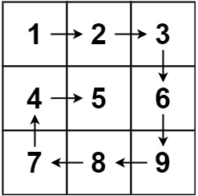
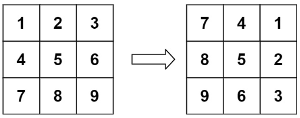

### 矩阵

**核心**：分清行和列

```java
int[][] matrix = { //一个4x2的矩阵
    {1, 2},  // 第一行
    {3, 4},  // 第二行
    {5, 6},  // 第三行
    {7, 8}   // 第四行
};
```

- 对于matrix `[4][2]`

  - 4是列长，也是行个数

  ```java
  int colLth = matrix.length;
  ```

  - 2是行长，也是列个数

  ```java
  int rowLth = matrix[0].length;
  ```


#### 73.对一个 `m x n` 的矩阵进行修改：如果某个元素为 `0`，则将其所在的行和列的所有元素都设置为 `0`。同时，题目要求使用 **原地算法**，即不能使用额外的矩阵存储结果。

```说明
输入：matrix = [[1,1,1],[1,0,1],[1,1,1]]
输出：[[1,0,1],[0,0,0],[1,0,1]]
```

- 思路

  - 如果直接遍历矩阵，遇到 `0` 就立即把对应的行和列置零，会导致以下问题：
    - 置零改变矩阵的原始状态，可能会错误地标记其他位置为 `0`。
    - 例如，在 `[1, 1]` 处发现了一个 `0`，然后立即将第 `1` 行和第 `1` 列置零，影响到后续的判断。
  - 为了解决这个问题，需要**先记录哪些行和列需要置零**，然后再统一处理置零操作。
  - 使用矩阵的**第一行和第一列**作为标记空间：
    - 第一行用来标记哪些列需要置零。
    - 第一列用来标记哪些行需要置零。
    - 为防止覆盖，需要先检查第一行和第一列是否有`0`

- 实现

  - 先单独检查第一行和第一列是否有 `0`。

  如果有 `0`，用两个布尔变量记录下来，表示最后需要对第一行或第一列置零。

  - 用第一行和第一列记录需要置零的行和列

  遍历矩阵的剩余部分（从 `[1, 1]` 开始），如果某个元素是 `0`，则将其对应的行索引和列索引分别记录在第一行和第一列中。

  - 根据标记置零

  只判断非0行非0列

  - 处理第一行和第一列

  ```java
     public void setZeroes(int[][] matrix) {
          //列长：行元素个数
          int colLth = matrix.length;
          //行长：列元素个数
          int rowLth = matrix[0].length;
          boolean firstColZero = false;
          boolean firstRowZero = false;
          //检查第一行
          for(int j = 0; j < rowLth; j++){
              if(matrix[0][j] == 0){
                  firstRowZero = true;
                  break;
              }}
          //检查第一列
          for(int i = 0; i < colLth; i++){
              if(matrix[i][0] == 0){
                  firstColZero = true;
                  break;
              }}
         // 使用第一行和第一列记录需要置零的行和列
          for(int i = 1; i < colLth; i++){
              for(int j = 1; j < rowLth; j++) {
                  if(matrix[i][j] == 0){
                      matrix[i][0] = 0;
                      matrix[0][j] = 0;
                  }}}
          for(int i = 1; i < colLth; i++){
              for(int j = 1; j < rowLth; j++) {
                  if(matrix[i][0] == 0 || matrix[0][j] == 0){
                      matrix[i][j] = 0;
                  }}}
          if(firstRowZero){
              for(int j = 0; j < rowLth; j++)
              {
                  matrix[0][j] = 0;
              }}
          if(firstColZero){
              for(int i = 0; i < colLth; i++)
              {
                  matrix[i][0] = 0;
              }}}
  ```

  

#### 54.给你一个 `m` 行 `n` 列的矩阵 `matrix` ，请按照 **顺时针螺旋顺序** ，返回矩阵中的所有元素。



- 思路

  - 按照顺时针的方向（右 -> 下 -> 左 -> 上）依次遍历矩阵。
  - 使用一个方向数组 `DIRS` 来控制遍历的方向。
  - 每次尝试沿着当前方向移动一步，如果遇到边界或者已经访问过的元素，则顺时针转向下一个方向。

  

- 实现
  - 初始化方向矩阵DIRS和其他
  - 遍历矩阵
  - 添加元素并将已添加元素改为`Integer.MAX_VALUE`
  - 若到头或碰到`Integer.MAX_VALUE`，转向

```java
    private static final int[][] DIRS = {{0, 1}, {1, 0}, {0, -1}, {-1, 0}};     
	public List<Integer> spiralOrder(int[][] matrix) {
        int colLth = matrix.length;
        int rowLth = matrix[0].length;
        List<Integer> ans = new ArrayList<>(colLth * rowLth); // 预分配空间
        int i = 0, j = 0, di = 0;
        for (int k = 0; k < colLth * rowLth; k++) { // 一共走 mn 步
            ans.add(matrix[i][j]);
            matrix[i][j] = Integer.MAX_VALUE; // 标记，表示已经访问过（已经加入答案）
            int x = i + DIRS[di][0];
            int y = j + DIRS[di][1]; // 下一步的位置
            // 如果 (x, y) 出界或者已经访问过
            if (x < 0 || x >= colLth || y < 0 || y >= rowLth || matrix[x][y] == Integer.MAX_VALUE) {
                di = (di + 1) % 4; // 右转 90°
            }
            i += DIRS[di][0];
            j += DIRS[di][1]; // 走一步
        }
        return ans;
    }
```


#### 48.给定一个 *n* × *n* 的二维矩阵 `matrix` 表示一个图像。请你将图像顺时针旋转 90 度。你必须在**[ 原地](https://baike.baidu.com/item/原地算法)** 旋转图像，这意味着你需要直接修改输入的二维矩阵。**请不要** 使用另一个矩阵来旋转图像。



- 思路
  - 沿主对角线翻转（转置）：将矩阵的 `(i, j)` 元素与 `(j, i)` 元素交换。
  - 水平翻转每一行：将每一行的元素按中点对称交换。

- 实现

  - 遍历矩阵的上三角部分，将每个元素 `(i, j)` 与其对应的元素 `(j, i)` 交换
  - 对于每一行，将元素按中点对称交换。(对于长度为 `n` 的行，交换索引为 `j` 和 `n - 1 - j` 的元素)

  ```java
          int numMax = matrix.length;
          for(int i = 0; i < numMax; i ++){//转置
              for(int j = i + 1; j < numMax; j ++)
              {
                  int temp = matrix[i][j];
                  matrix[i][j] = matrix[j][i];
                  matrix[j][i] = temp;
              }
          }
          for (int i = 0; i < numMax; i++) {//以行中心翻转
              for (int j = 0; j < numMax / 2; j++) {
                  // 交换 matrix[i][j] 和 matrix[i][n - 1 - j]
                  int temp = matrix[i][j];
                  matrix[i][j] = matrix[i][numMax - 1 - j];
                  matrix[i][numMax - 1 - j] = temp;
              }
          }
  ```

  - 注意：处理逆时针90°翻转时，先转置，后**按照列中心翻转**