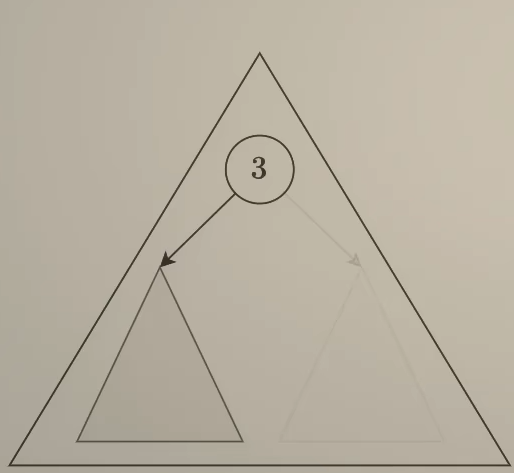

### 二叉树

#### **基本概念**

二叉树是由节点组成的集合，每个节点最多有两个子节点：左子节点和右子节点。二叉树的根节点没有父节点，叶节点没有任何子节点。

##### **1.基本元素**

- **根节点**：树的最顶点。
- **子节点**：直接连接到另一个节点的下方的节点。
- **父节点**：直接连接到一个节点上方的节点。
- **叶节点：没有子节点的节点。
- **内部节点**：至少有一个子节点的节点。

##### **2. 二叉树的类型**

- **满二叉树**：除了叶节点外，每个节点都有两个子节点。
- **完全二叉树**：所有层级都被填满，除了最后一层，从左到右依次填入。
- **平衡二叉树**：左右子树的高度差不超过1。
- **二叉搜索树**：对于任意节点，左子树的所有节点值小于该节点值，右子树的所有节点值大于该节点值。

##### **3. 基本操作**

**遍历**

按照某种顺序访问二叉树中的所有节点。常见的遍历方式：（对应递归实现）

- **前序遍历**：访问根节点 -> 遍历左子树 -> 遍历右子树。**递归：打印 - 左 - 右**
- **中序遍历**：遍历左子树 -> 访问根节点 -> 遍历右子树。**递归：左 - 打印 - 右**
- **后序遍历**：遍历左子树 -> 遍历右子树 -> 访问根节点。**递归：左 - 右 - 打印**
- **层次遍历**：按层次从上到下、同层从左到右访问节点。（也称广度优先搜索）
- DFS（深度优先搜索）   BFS（广度优先搜索）

**插入**

在二叉搜索树中，根据数值大小决定插入位置：

- 如果新值小于当前节点值，则插入到左子树；如果大于，则插入到右子树。

**删除**

1. 被删除节点是叶节点：直接删除。
2. 被删除节点只有一个子节点：用子节点替换被删除节点。
3. 被删除节点有两个子节点：找到右子树中最小的节点（或左子树中最大的节点），用它替换被删除节点，并删除那个最小（最大）节点。

#### 递归三要素

- 明确函数的功能

  将问题分解成较小的子问题并通过递归来解决。

- 递归的结束条件

​	确定何时停止递归。

- 确定递归函数的参数和返回值


#### 94.给定一个二叉树的根节点 `root` ，返回 *它的 **中序** 遍历* 。

- 思路

按照上面基本概念，递归：左 - 打印 - 右

- 实现

  - 如果当前节点为空，直接返回。
  - 递归地遍历左子树。
  - 将当前节点的值加入结果列表。
  - 递归地遍历右子树。

  ```java
      public List<Integer> inorderTraversal(TreeNode root) {
          List<Integer> result = new ArrayList<>();
          inorderHelp(result, root);
          return result;
      }
      private void inorderHelp(List<Integer> result, TreeNode root){
          if(root == null){
              return;
          }
          inorderHelp(result, root.left);
          result.add(root.val);
          inorderHelp(result, root.right);
      }
  ```


#### 104.给定一个二叉树 `root` ，返回其最大深度。二叉树的 **最大深度** 是指从根节点到最远叶子节点的最长路径上的节点数。

- 思路

  首先，确认返回值`max（左子树深度，右子树深度）+1`。然后判断停止条件，`root == null 时返回0`。参数获取通过迭代，且每次迭代往目标更近。

  ```java
      public int maxDepth(TreeNode root) {
          if(root == null ){
              return 0;
          }
          int left = maxDepth(root.left);
          int right = maxDepth(root.right);
          return Math.max(left, right) + 1;
      }
  ```


#### 105.给你一棵二叉树的根节点 `root` ，翻转这棵二叉树，并返回其根节点。

- 思路

  首先，明确返回根节点，返回有了。判断为null，直接返回，条件有了。现在如何进行交换，对于倒数第二层(最后一层的父节点)，应该将左节点和有节点互换，只能这里做递归了。

  ```java
      public TreeNode invertTree(TreeNode root) {
          if( root == null){
              return null;
          }
          TreeNode left = invertTree(root.left);
          TreeNode right = invertTree(root.right);
  
          root.left = right;
          root.right = left;
          return root;
      }
  ```


#### 101.给你一个二叉树的根节点 `root` ， 检查它是否轴对称。

- 思路

  看待二叉树递归问题，理解为root的(左子树与右子树)，左子树中同样是判断(左子树与右子树)，形成递归

  首先返回bool：左子树的左子树与右子树的右子树 与 左子树的右子树与右子树的左子树 都判断相同

  停止条件：左子树与右子树为null，按情况返回

  

```java
    public boolean isSymmetric(TreeNode root) {
        if(root == null)
            return true;
        return isMirror(root.left, root.right);
    }
    private boolean isMirror(TreeNode left, TreeNode right){
        if(left == null && right == null){
            return true;
        }
        if(left == null || right == null || left.val != right.val){
            return false;
        }
        return isMirror(left.left, right.right) && isMirror(left.right, right.left);
    }
```


#### 102.给你二叉树的根节点 `root` ，返回其节点值的 **层序遍历** 。 （即逐层地，从左到右访问所有节点）。

- 思路

  使用队列装载每层节点，在遍历时输出节点同时输入该节点的左右子节点，直到本层节点输出完。使用了队列的先进先出机制。

- 实现

  1.初始化队列

  - 创建一个空队列，用于存储当前层的节点。
  - 将根节点 `root` 加入队列中（如果根节点为空，则直接返回空结果）。

  2.层序遍历

  - 使用一个循环，直到队列为空：
    1. 记录当前层的节点数量：在每一轮循环开始时，记录当前队列的大小（即当前层的节点数）。
    2. 处理当前层的所有节点：
       - 从队列中依次取出节点，访问该节点的值（例如将其值加入结果列表）。
       - 将该节点的左子节点和右子节点（如果存在）依次加入队列中。
    3. 进入下一层：当当前层的所有节点都被处理完毕后，继续处理下一层。

  3.结束条件

  - 当队列为空时，说明所有层的节点都已访问完毕，结束遍历。

  ```java
      public List<List<Integer>> levelOrder(TreeNode root) {
          List<List<Integer>> result = new ArrayList<>();
          if(root == null)
          return result;
          // 创建一个队列，用于辅助层序遍历
          Queue<TreeNode> queue = new LinkedList<>();
          queue.add(root);
          // 层序遍历
          while(!queue.isEmpty()){
              // 当前层的节点数量
              int levelSize = queue.size();
              // 存储当前层的节点值
              List<Integer> tempNums = new ArrayList<>();
              // 遍历当前层的所有节点
              while(levelSize > 0){
                  // 从队列中取出节点,并加入列表
                  TreeNode tempNum = queue.poll();
                  tempNums.add(tempNum.val);
                  // 将该节点的左子节点和右子节点加入队列
                  if(tempNum.left != null) queue.add(tempNum.left);
                  if(tempNum.right != null) queue.add(tempNum.right);
                  levelSize --;
              }
              result.add(tempNums);
          }
          return result;
      }
  ```

  - 队列（先进先出，头出尾入）

    `boolean offer(E e)`

    - 将指定的元素插入此队列中。
    - 如果队列已满，返回 `false`。

    `E poll()`

    - 获取并移除此队列的头，如果队列为空，则返回 `null`。
    - 与 `remove` 方法相比，`poll` 方法在队列为空时不抛出异常。

    `E element()`

    - 获取但不移除此队列的头。
    - 如果队列为空，则抛出 `NoSuchElementException` 异常。

     `E peek()`

    - 获取但不移除此队列的头，如果队列为空，则返回 `null`。
    - 与 `element` 方法相比，`peek` 方法在队列为空时不抛出异常。

    `int size()`

    - 返回队列中的元素数量。

    `boolean isEmpty()`

    - 如果此队列包含无元素，则返回 `true`。

    `void clear()`

    - 移除队列中的所有元素。

#### 108.给你一个整数数组 `nums` ，其中元素已经按 **升序** 排列，请你将其转换为一棵 平衡 二叉搜索树。

- 思路

  已经排序的数组，按照中间点为根节点，序号小于mid的元素在做部分，其中左子树的跟子树是这部分的中间元素，可以用到递归，确定返回的是root，判断结果是left > rigth。没有元素了。核心部分是确定该范围的中点为根节点，左右分别不同方法递归。

- 实现

  1.确定根节点

  - 每次从当前数组中选择中间位置的元素作为根节点。

  2.构造左右子树

  - 根节点左侧的部分递归构造左子树。
  - 根节点右侧的部分递归构造右子树。

  3.组合结果

  - 将根节点与其左右子树组合起来，形成完整的二叉搜索树。

  ```java
      public TreeNode sortedArrayToBST(int[] nums) {
          if(nums == null || nums.length == 0)
          return null;
          return bulidBST(nums, 0, nums.length - 1);
      }
      private TreeNode bulidBST(int[] nums, int leftNum, int rightNum){
          if(leftNum > rightNum)
          return null;
          int mid = (leftNum + rightNum)/2;
          TreeNode root = new TreeNode(nums[mid]);
          root.left = bulidBST(nums, leftNum, mid - 1);
          root.right = bulidBST(nums, mid + 1, rightNum);
          return root;
      }
  ```

  
